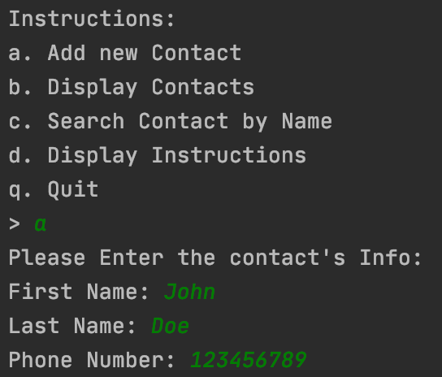
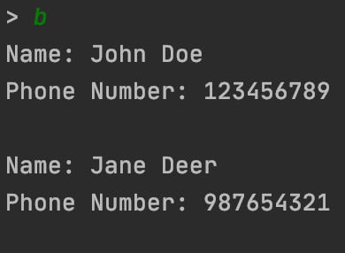
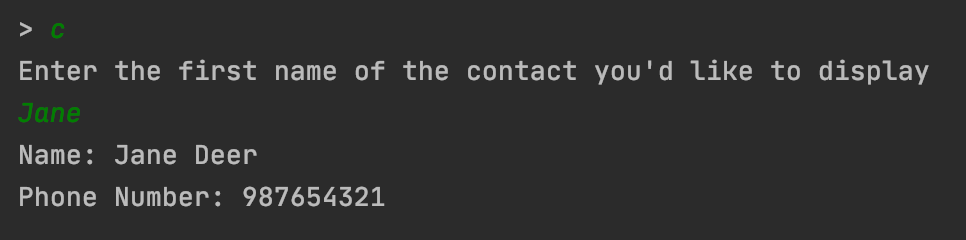

# Contacts Program #

## Description: ##
This Program is a simple Contacts program to display the usefulness of Object-oriented programming inside of the Java Language. In this particular program, you have the opportunity to create your very own contact and then do something with those contacts you create. You can create as many contacts as you'd like. You can add, display and search contacts in this simple program.

## Development Environment: ##
This program was written in Java. To compile and use this program, first you must to download the Java JDK, either the [commercial](https://www.oracle.com/java/technologies/javase-downloads.html) or the [open source](https://jdk.java.net/) versions.

After one of those JDK versions is downloaded, download and IDE like [IntelliJ](https://www.jetbrains.com/idea/) to compile and run the program.

## How to Build/Execute the program: ##
After downloading [IntelliJ](https://www.jetbrains.com/idea/), open the folder containing the files of the program. Once the project opens, you should be able to run and compile the program by pressing the green play button in the top right corner of the window.

## Screenshots: ##

## Useful Websites: ##
* [W3 Schools Java](https://www.w3schools.com/java/)
* [Learn Java in 14 minutes](https://www.youtube.com/watch?v=RRubcjpTkks&t=559s)
* [Java Classes](https://www.w3schools.com/java/java_classes.asp)